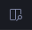

# W2 Tailwind CSS Intro

Learn Tailwind CSS

## 🚀 Setup Instructions

### Prerequisites
- Modern web browser
- Text editor (VS Code recommended)
- Basic HTML/CSS knowledge

### How to Run the Code
**Option 1: Live Preview (Recommended)**
- Make sure you have the Live Preview extension installed (if not, navigate to extensions in VSCode, and search for Live Preview, then install the extension)
- While editing your `index.html` file, you will see a split screen icon with a magnifying glass, that is your live preview.  Click that to open an auto-updating browser window in your VSCode

**Option 2: Manual**
- Navigate to `w2_intro_to_tailwind/lab`
- Open `index.html` in your browser

## 📁 Project Structure

```
w2-intro-to-tailwind/
├── instructions.md
├── assets/
├── lab/
│   ├── container-basic/        # Exercise
│   │   ├── index.html          <-- You Edit this
│   │   ├── styles.css          <-- You Edit this
│   │   └── README.md
│   ├── Lesson/                 # Read this first
│   │   ├── tailwind-css-lesson.md

```

## 📚 Learning Steps

### Step 1: Read the Lessons
1. Go to `Lesson/` folder
2. **Preview** `tailwind-css-lesson.md` before moving on to the lab
4. Take notes on key concepts while reading

**💡 Tip**: In VS Code, right-click the .md file and select "Open Preview" for better formatting

### Step 2: Complete Lab

- Follow the instructions in the `README.md` file within the lab directory.

## 💻 Browser Support
Chrome 57+, Firefox 52+, Safari 10.1+, Edge 16+

## 🎯 What You'll Learn
- Tailwind CSS Fundamentals
- Basic Tailwind CSS Utility Classes

---

**Remember**: Read lessons first → Complete lab

Happy coding! 🎉
